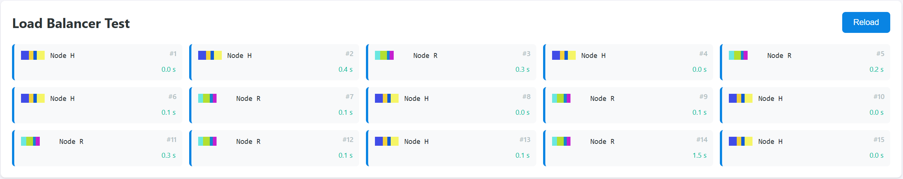
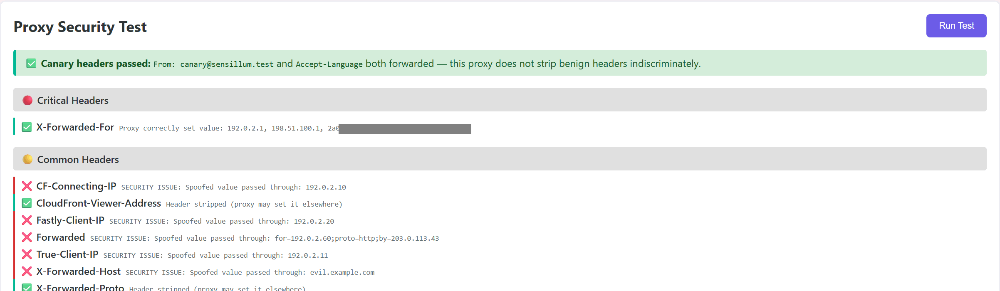
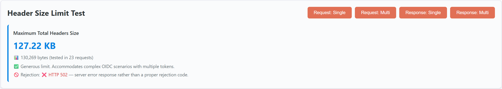
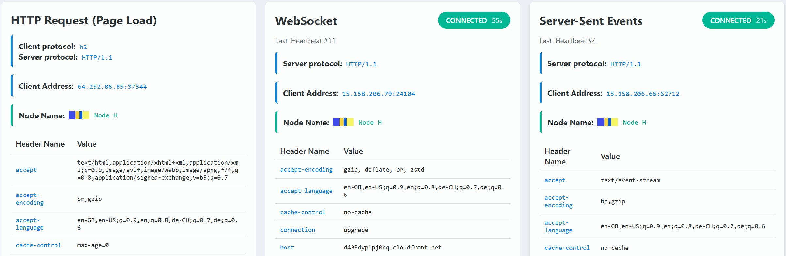
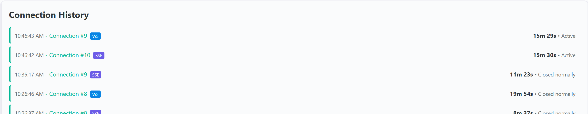

# Sensillum

**Sensillum** is a small, self-contained web server you put behind a
 reverse proxy, load balancer, or CDN to answer a simple question:

> “Is my reverse proxy configured correctly?”

It echoes request headers, probes header size limits, scans for common
 security holes, and more -- all from a single-page browser UI.

As a single static, batteries-included binary, you simply download it,
run it, and point your proxy to it. No installation or configuration
is necessary.

### Live demo

Each of these demo sites point to the same Sensillum servers.
Note how differently they behave.

- https://sensillum-demo.anthonyuk.dev/ - uses CloudFlare
- https://sensillum-fastly-demo.anthonyuk.com/ - uses Fastly
- https://sensillum-gcore-demo.anthonyuk.com/ - uses Gcore

### Main Features

**Load balancer diagnostics**:
Is your traffic distributed evenly? Get a quick visual overview
of traffic distribution to your backends.



**Proxy header security test**:
Can the end user spoof the `X-Forwarded-For` header?
Check whether spoofed headers are stripped by the proxy.



**Header & URL length limits**:
Are your OIDC flows failing? Often that's because your proxy blocks
large headers. Check your proxy's individual and total limits.



**WAF test**:
It's 2026, everyone should be blocking Log4J and ShellShock attacks
at the very least. Sensillum checks the most common payloads at
the header, URL and response level.


**Headers**:
See exactly what headers your proxy is sending to your backend,
whether via HTTP or WebSocket.



**WebSocket/SSE timeouts**:
Attempt to establish a WebSocket and SSE connection, and check how
long it takes for the proxy to close the connection.



## Quick start

```bash
docker run -p 3030:3030 ghcr.io/dataway/sensillum:latest
```

Then point your proxy to port 3030, or just open http://localhost:3030 in your browser.

You can also download binaries from the [releases page](https://github.com/dataway/sensillum/releases).

## Configuration

All options are available as environment variables and as CLI flags. CLI flags take precedence.

| Short flag | Long flag | Environment variable | Default | Description |
| ---------- | --------- | -------------------- | ------- | ----------- |
| `-p`       | `--port`  | `SENSILLUM_PORT`     | `3030`  | HTTP port |
| `-n`       | `--node`  | `SENSILLUM_NODE`     | _(none)_ | Node name to be displayed in UI |
| `-x`       | `--prefix` | `SENSILLUM_PREFIX`  | _(none)_ | URL prefix when serving under a subpath |
| `-P`       | `--privacy` | `SENSILLUM_PRIVACY` | _(off)_ | Privacy mode |
| `-r`       | `--redact`  | `SENSILLUM_REDACT`  | `x-origin-secret` | Redact request headers from response |

By default, the server includes its own IP address, hostname, build timestamp, and URL prefix in responses.
You can disable this with the `--privacy` flag or `SENSILLUM_PRIVACY` environment variable.

You can send a node name to the client, which will decorate it with a colourful ribbon.
This helps you to understand the load balancer test at a glance. Use `--node` or `SENSILLUM_NODE` to set any
string that makes sense to you.

There are some request headers which you might want to hide from the user.
List them by repeating the `--redact` flag or setting `SENSILLUM_REDACT` to a comma-separated list of header prefixes. By default, only `x-origin-secret` is redacted.

## About Sensillum

**Sensillum** was written by [Anthony Uk](https://www.anthonyuk.com)
in order to shed light onto my warren of nginx, Traefik, MetalLB, haproxy, F5, Netscaler, A10 and CloudFlare proxies.
I am making it available in the hope that it will be useful to others.

AI assistance was used, especially for the frontend, but I have fully understood and vetted the code.
Any bugs or security issues are my responsibility.

License: [MIT License](./LICENSE)
